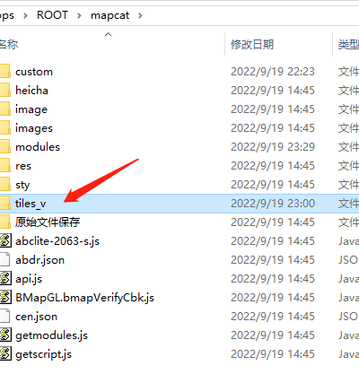
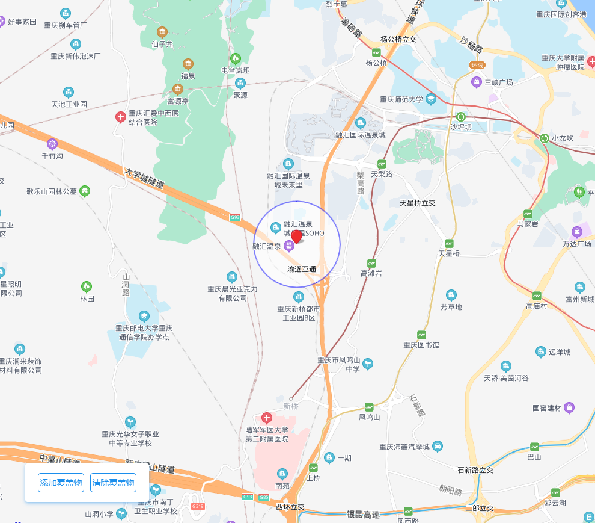
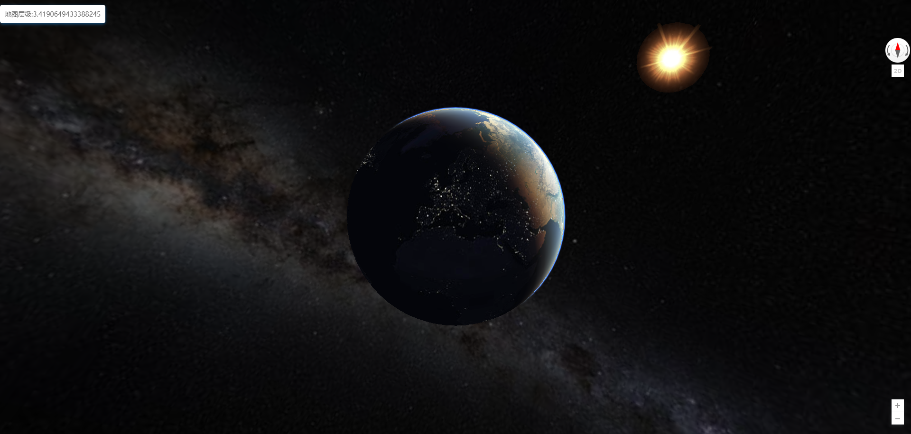
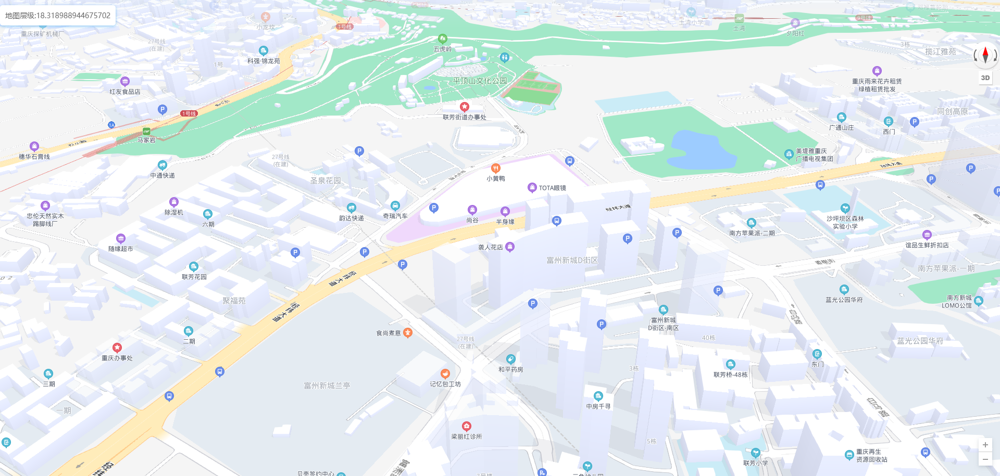
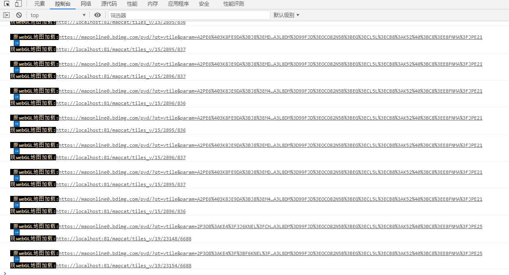
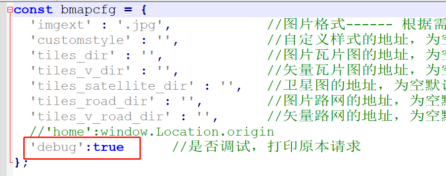

# mapcat
地图猫,最新矢量地图，非瓦片，全新3D模型效果

# 运行命令：
> bin\startup.bat

# 访问地址:
> http://localhost:81/

# demo案例
> http://localhost:81/demo/index.html

# 矢量图下载:
> QQ: https://share.weiyun.com/K5m1wAVw

> 百度网盘: https://pan.baidu.com/s/14WYttrw6vU5gwqsT1nB80g?pwd=asfw 提取码: asfw

# 矢量地图

# 运行效果

# 全新调试模式

